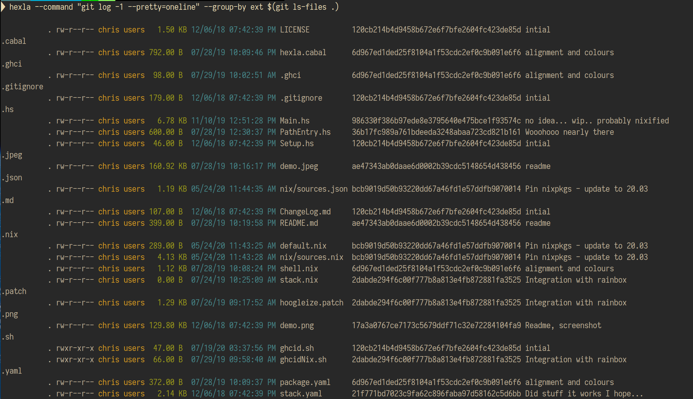

# Hexla - a soon to be improved ls in Haskell

## What problem does this solve?

It's laying the foundation for a better FS viewer. It's inspired by https://github.com/ogham/exa

## Limitations
It's a work in progress, things are a bit messy (and slow!!??). Missles could be fired due to the use of IO. 
Needs `nix` in order to build/install - `nix-env -i -f default.nix`.
